# 🌱 StressBud — Your Exam Season Companion

StressBud is an AI-powered chatbot that helps students cope with exam-related stress. It detects the type of stress a student is facing and responds with empathy, practical advice, and mental health resources.

---

##  Problem Statement

Students face three major stressors during exam season:

| Category | Examples |
|---|---|
| **SOS** | Anxiety, panic attacks, depression, self-harm urges |
| **Pressure** | Family expectations, peer comparison, performance anxiety |
| **Syllabus** | Pending revision, last-minute cramming, time management |

---

##  Tech Stack

| Layer | Technology |
|---|---|
| Frontend | Streamlit (Python) |
| Backend | FastAPI (Python) |
| AI Model | Google Gemini 1.5 Flash |
| NLP | Keyword-based sentiment detection |


---

##  How It Works

```
User types message
       ↓
Streamlit frontend (POST /api/chat)
       ↓
FastAPI backend
       ↓
Sentiment detection → detects category (SOS / Pressure / Syllabus / General)
       ↓
Gemini 1.5 Flash → generates response using category-specific system prompt
       ↓
Response returned to frontend
```

---

##  Getting Started

### Prerequisites
- Python 3.10+
- Google Gemini API key → [aistudio.google.com](https://aistudio.google.com)

---

### 1. Clone the repository

```bash
git clone https://github.com/your-username/stressbud.git
cd stressbud
```

---

### 2. Set up the Backend

```bash
cd backend
python -m venv venv

# Windows
venv\Scripts\activate

# Mac/Linux
source venv/bin/activate

pip install -r requirements.txt
```

Create a `.env` file inside the `backend/` folder:

```
GEMINI_API_KEY=your_gemini_api_key_here
```

Start the backend:

```bash
 python -m uvicorn backend.main:app --reload
```

Backend runs at → `http://127.0.0.1:8000`

Test it at → `http://127.0.0.1:8000/docs`

---

### 3. Set up the Frontend

Open a **new terminal**:

```bash
pip install -r requirements.txt
streamlit run app.py
```

Frontend runs at → `http://localhost:8501`

---

##  Environment Variables

| Variable | Description |
|---|---|
| `GEMINI_API_KEY` | Your Google Gemini API key from [aistudio.google.com](https://aistudio.google.com) |

---

##  API Endpoints

| Method | Endpoint | Description |
|---|---|---|
| `GET` | `/` | Health check |
| `GET` | `/health` | Server status |
| `POST` | `/api/chat` | Send a message, get AI response |
| `GET` | `/api/resources` | Get all stress relief resources |
| `GET` | `/api/categories` | Get all stress categories |

### POST `/api/chat` — Request Body

```json
{
  "message": "I have an exam tomorrow and I haven't studied",
  "session_id": "abc123",
  "history": []
}
```

### POST `/api/chat` — Response

```json
{
  "reply": "Hey, let's make a plan together...",
  "category": "syllabus",
  "session_id": "abc123",
  "resources": [...],
  "is_crisis": false
}
```

---

##  Stress Categories

| Category | Trigger Keywords | System Prompt |
|---|---|---|
| `sos` | panic, anxiety, self-harm, hopeless | Crisis support + grounding techniques |
| `pressure` | parents, comparison, expectations | Reframing + affirmations |
| `syllabus` | exam, chapters, revision, cramming | Study plan + Pomodoro |
| `general` | anything else | General support |

---
## Screenshots

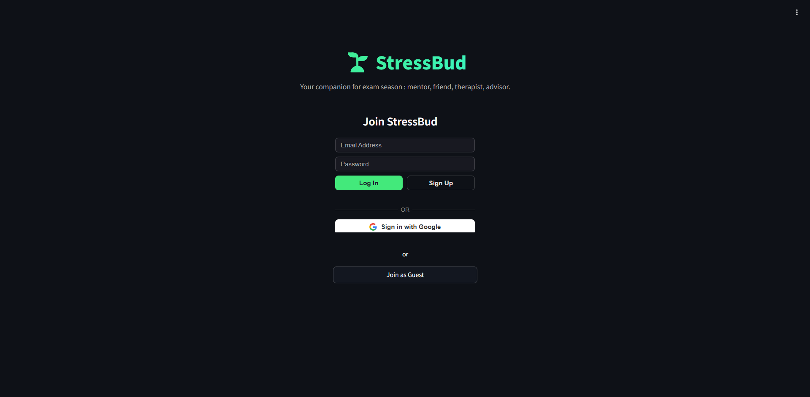

---
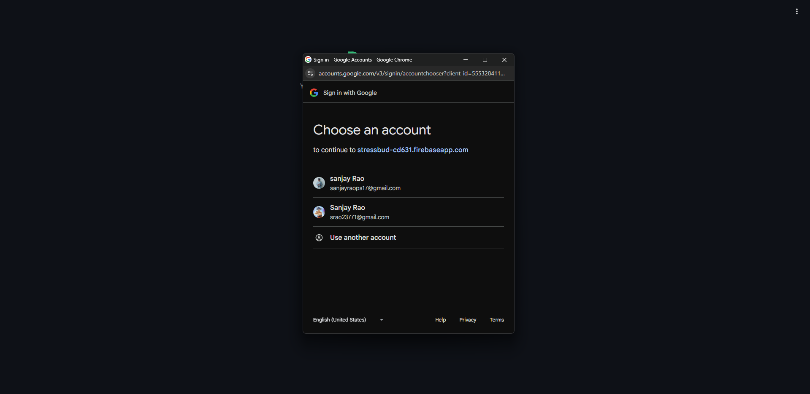

---
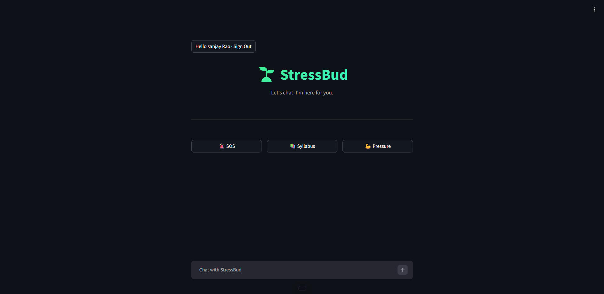

---
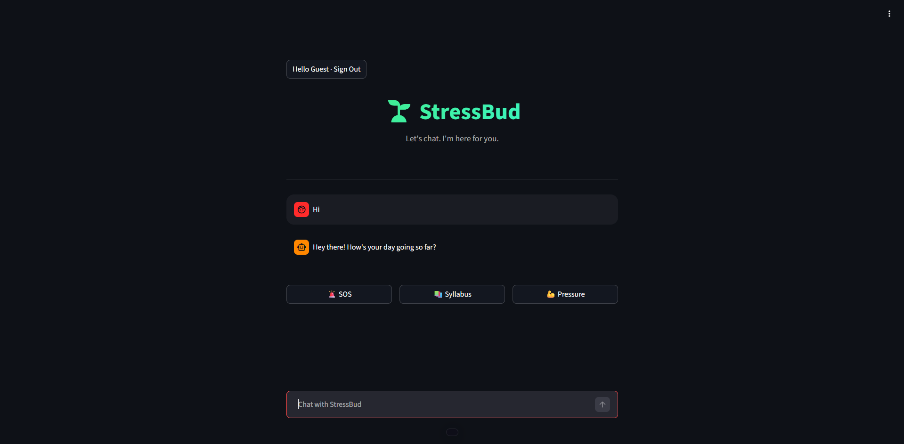

---
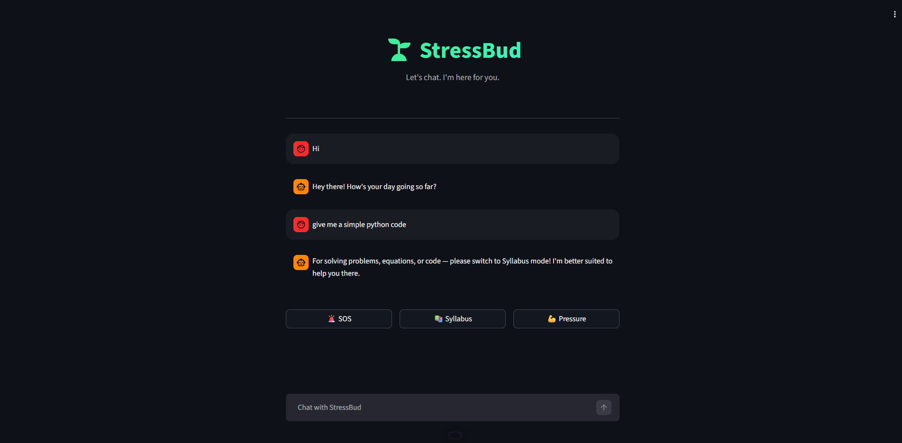

---
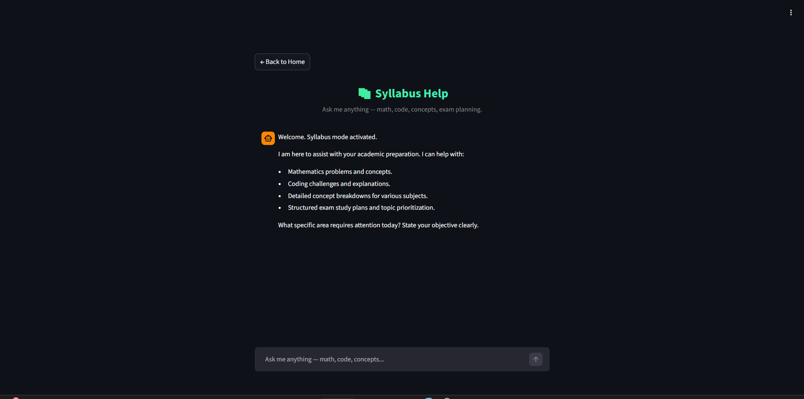

---
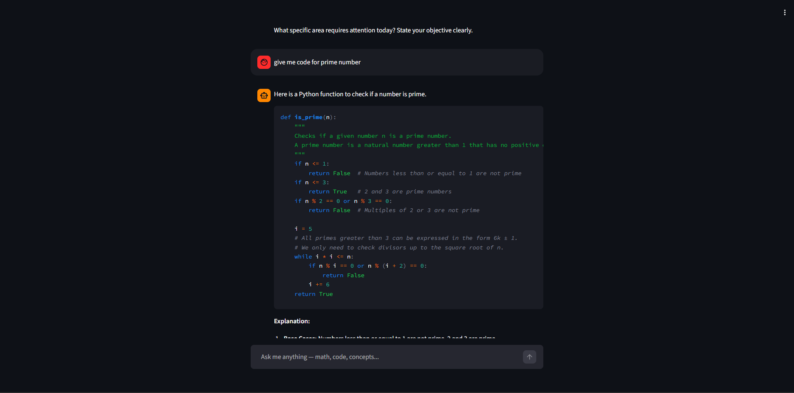

---
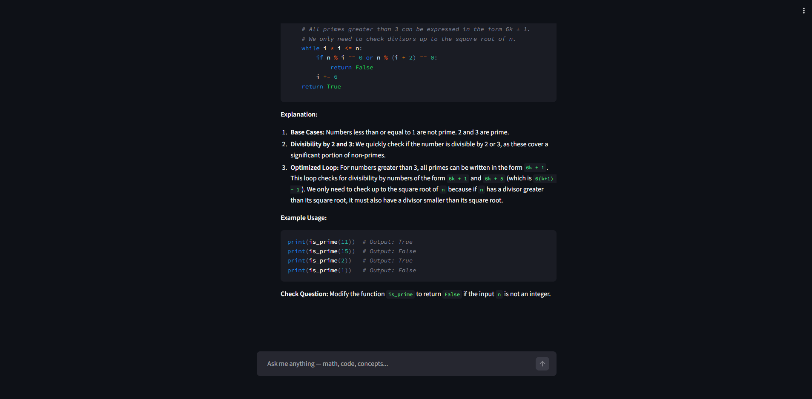

---
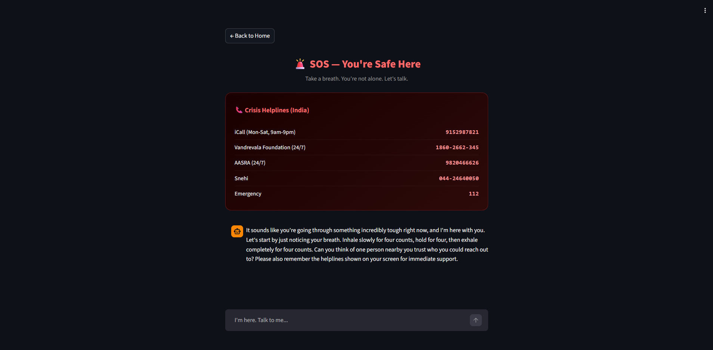

---
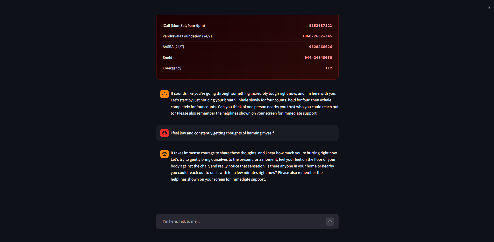

---
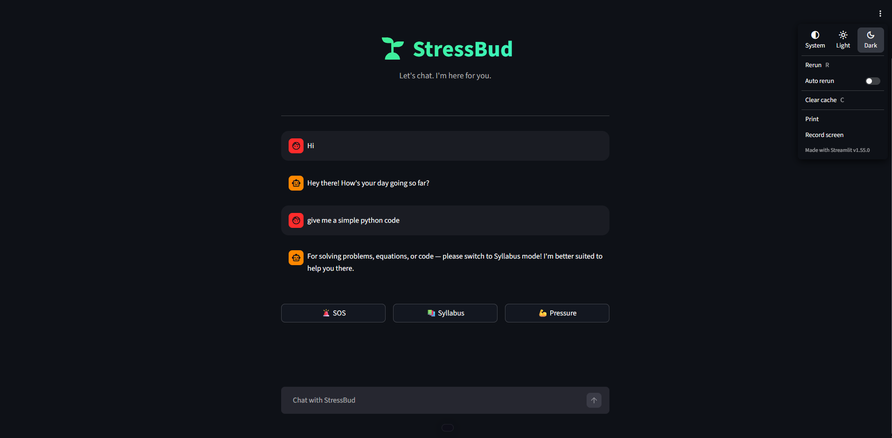


---

##  Disclaimer

StressBud is an AI companion and is **not a substitute for professional mental health support**. If you or someone you know is in crisis, please contact a helpline immediately.

---

##  Team

Built for students, by students — during a hackathon.
